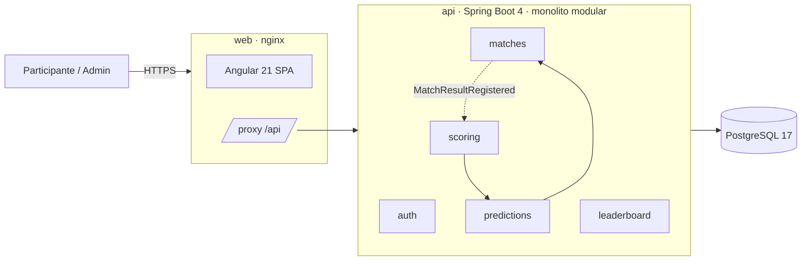

# ⚽ Polla Mundialista

Aplicación fullstack para que un grupo privado prediga los marcadores de la fase de grupos, sume puntos y compita en
un ranking. El administrador carga los resultados reales y los puntos se recalculan solos.

**Stack:** Java 21 · Spring Boot 4.1 · Spring Modulith · Spring Security (JWT) · PostgreSQL 17 · Flyway ·
Angular 21 (zoneless, signals) · Angular Material 3 · Docker · GitHub Actions

> Desarrollado con enfoque **AI-First** y **Spec-Driven Development**: las specs y el contrato OpenAPI se escribieron
> antes que el código. Ver [`specs/`](specs/), [`docs/AI_LOG.md`](docs/AI_LOG.md) y [`CLAUDE.md`](CLAUDE.md).

---

## Contenido

- [Funcionalidades](#funcionalidades)
- [Levantar el proyecto](#levantar-el-proyecto)
- [Usuarios de prueba](#usuarios-de-prueba)
- [Arquitectura](#arquitectura)
- [Decisiones técnicas](#decisiones-técnicas)
- [Seguridad](#seguridad)
- [Calidad y pruebas](#calidad-y-pruebas)
- [Estructura del repositorio](#estructura-del-repositorio)

---

## Funcionalidades

| Módulo | Qué hace | Spec |
|---|---|---|
| **Auth y usuarios** | Registro, login, sesión persistente con refresh token rotativo, roles `USER` / `ADMIN` | [01-auth](specs/01-auth/spec.md) |
| **Predicciones** | 12 partidos precargados (2 grupos); predicción editable hasta el inicio del partido; puntuación 3/1/0 | [02-predictions](specs/02-predictions/spec.md) |
| **Panel admin** | Registrar y **corregir** resultados, con confirmación y control de concurrencia | [03-admin-results](specs/03-admin-results/spec.md) |
| **Ranking** | Tabla global con desempates y podio; historial por participante | [04-leaderboard](specs/04-leaderboard/spec.md) |

Reglas de negocio destacadas (detalle en [00-vision](specs/00-vision.md)):

- **RN-02:** las predicciones se cierran al inicio del partido y lo valida el **servidor**, no el navegador.
- **RN-05:** registrar o corregir un resultado recalcula los puntos de forma **idempotente** (no se duplican).
- **RN-06:** las predicciones ajenas solo se ven cuando el partido cerró, para que nadie copie.
- **RN-07:** desempate por puntos → exactos → aciertos de ganador; los empatados comparten posición.
- **RN-09:** el admin **no participa**: quien carga resultados no compite (conflicto de interés).

## Levantar el proyecto

### Opción A · Todo con Docker (recomendada)

Requisitos: Docker.

```bash
cp .env.example .env
docker compose up --build
```

Abre **http://localhost:4000** · Swagger UI: http://localhost:4000/swagger-ui.html

### Opción B · Modo desarrollo

Requisitos: Java 21, Node 24 y Docker (para Postgres).

```bash
# Terminal 1 · API en :8080. Levanta Postgres automáticamente con Testcontainers.
cd backend
./mvnw spring-boot:test-run

# Terminal 2 · Angular en :4200 con proxy /api → :8080
cd frontend
npm install
npm start
```

Abre **http://localhost:4200**.

> ¿Prefieres tu propio Postgres? `docker compose up -d db` y luego
> `./mvnw spring-boot:run -Dspring-boot.run.profiles=local`.

### Variables de entorno

| Variable | Descripción | Default |
|---|---|---|
| `JWT_SECRET` | Secreto HS256 en Base64 (≥ 32 bytes). **Obligatoria** fuera del perfil `local`. | — |
| `ADMIN_EMAIL` / `ADMIN_PASSWORD` | Cuenta admin creada al arrancar | — |
| `DB_URL` / `DB_USERNAME` / `DB_PASSWORD` | Conexión a PostgreSQL | `localhost:5432/polla` |
| `DEMO_DATA` / `DEMO_PASSWORD` | Crea 4 participantes demo con predicciones | `false` |
| `COOKIE_SECURE` | Cookie de refresh solo por HTTPS | `true` |
| `CORS_ALLOWED_ORIGINS` | Solo si el front se sirve en otro origen | vacío |

## Usuarios de prueba

Con `DEMO_DATA=true` (por defecto en Docker y en modo desarrollo):

| Rol | Email | Contraseña |
|---|---|---|
| Admin | `admin@polla.local` | valor de `ADMIN_PASSWORD` (`.env.example`) |
| Usuario | `ana@polla.local` (también `carlos@`, `valentina@`, `diego@`) | valor de `DEMO_PASSWORD` (`.env.example`) |

## Arquitectura

Documentación completa con diagramas C4: [`docs/arquitectura.md`](docs/arquitectura.md).



- **Mismo origen:** nginx sirve la SPA y hace de proxy de `/api`, así la cookie de refresh es *first-party*.
- **Monolito modular** (Spring Modulith): un test hace fallar el build si un módulo accede a internos de otro.
- **Eventos de dominio:** al registrar un resultado, `matches` publica `MatchResultRegistered` y `scoring` recalcula.
  Los eventos se persisten (patrón outbox) y se reintentan si fallan.

## Decisiones técnicas

Cada decisión relevante está registrada como ADR:

| ADR | Decisión |
|---|---|
| [0001](specs/adr/0001-stack-tecnologico.md) | Stack: Spring Boot 4 + Angular 21 + PostgreSQL |
| [0002](specs/adr/0002-monolito-modular.md) | Monolito modular en vez de microservicios, y cómo escala |
| [0003](specs/adr/0003-eventos-de-dominio.md) | Recálculo de puntos por eventos de dominio, idempotente |
| [0004](specs/adr/0004-estrategia-tokens.md) | JWT en memoria + refresh token en cookie HttpOnly |
| [0005](specs/adr/0005-contract-first.md) | Contract-first con OpenAPI y cliente Angular generado |

Esquema de base de datos: [`specs/database.md`](specs/database.md) (migraciones en
`backend/src/main/resources/db/migration`).

## Seguridad

- Contraseñas con **BCrypt**; política de contraseña validada en front y back.
- **Access token** JWT de 15 min guardado solo en memoria (no en `localStorage`) → sin exfiltración persistente por XSS.
- **Refresh token** opaco en cookie `HttpOnly; Secure; SameSite=Strict; Path=/api/v1/auth`, guardado **hasheado**,
  **rotado** en cada uso y con **detección de reutilización** (revoca todas las sesiones).
- **Rate limiting** de login por IP (10/min) → `429` con `Retry-After`.
- Mensajes de login genéricos y tiempo de respuesta igualado → no permite enumerar emails.
- Autorización en **dos capas** (URL + `@PreAuthorize`); el front oculta la UI pero la regla vive en el backend.
- Concurrencia optimista (`@Version`) en resultados; `UNIQUE(user_id, match_id)` en predicciones.
- Errores uniformes **RFC 9457** sin *stack traces*; cabeceras CSP, `X-Frame-Options`, `nosniff`.
- Secretos solo por variables de entorno; la app **no arranca** sin un `JWT_SECRET` válido.

## Calidad y pruebas

```bash
cd backend && ./mvnw verify        # 40 pruebas: unitarias + integración (Postgres real) + módulos + contrato
cd frontend && npm test            # 16 pruebas (Vitest)
```

| Tipo | Qué cubre |
|---|---|
| Unitarias | Tabla de verdad de la puntuación (spec 02), rate limiter |
| Integración (Testcontainers) | Cada criterio de aceptación `CA-xx` de las specs, contra PostgreSQL real |
| Arquitectura | `ModularityTests`: límites entre módulos y ausencia de ciclos |
| Contrato | `ApiContractTest`: endpoints del backend = `openapi.yaml`. En CI: el cliente Angular generado = `openapi.yaml` |
| Frontend | Interceptor (refresh único compartido), tarjeta de partido, utilidades |

CI en GitHub Actions: backend, frontend y build de imágenes Docker en cada push.

## Estructura del repositorio

```
specs/                  SDD: visión, specs por módulo, OpenAPI, ADRs, esquema de BD
backend/                Spring Boot 4 · dev.leiber.polla.{auth,matches,predictions,scoring,leaderboard,shared}
frontend/               Angular 21 · src/app/{core,features,api(generado)}
docs/                   Arquitectura (C4), AI_LOG
CLAUDE.md               Reglas para agentes de IA en este repo
docker-compose.yml      Stack completo: db + api + web
```
