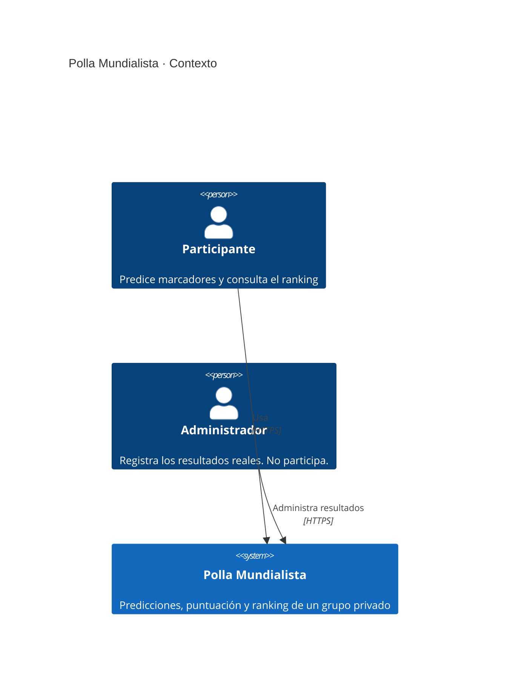
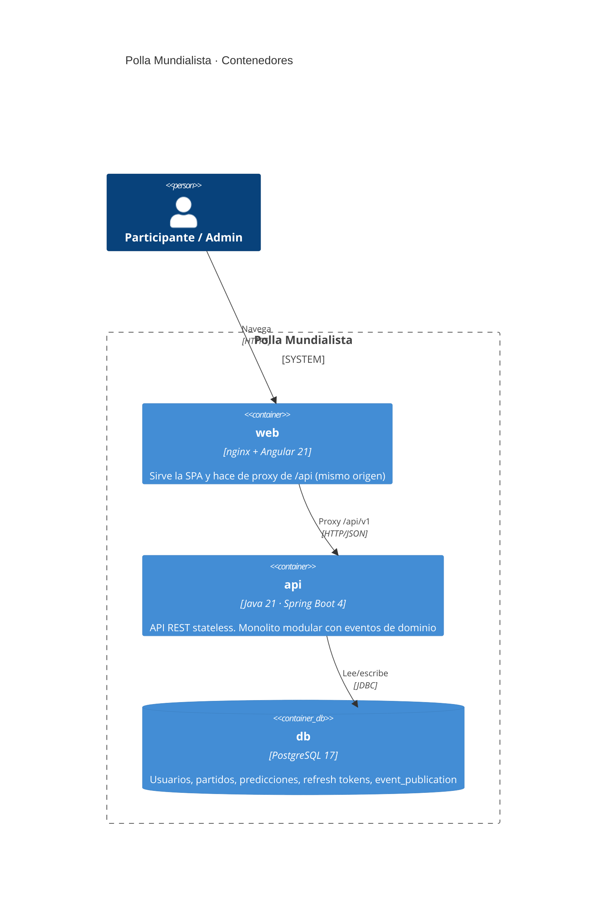
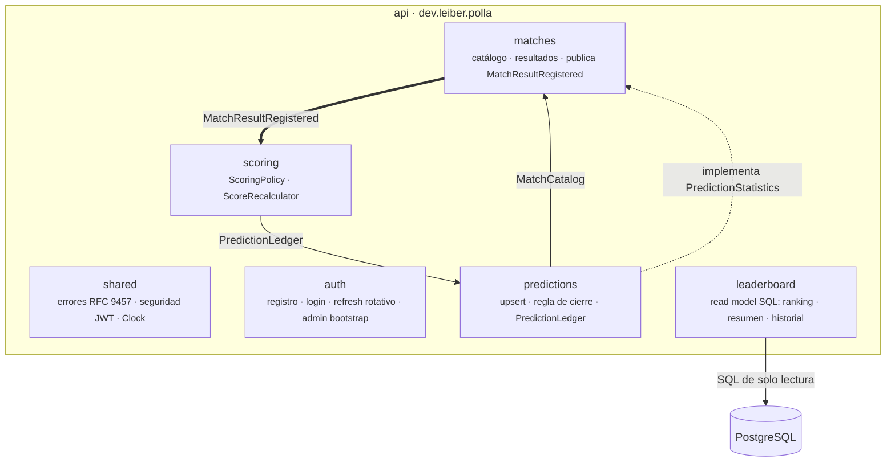
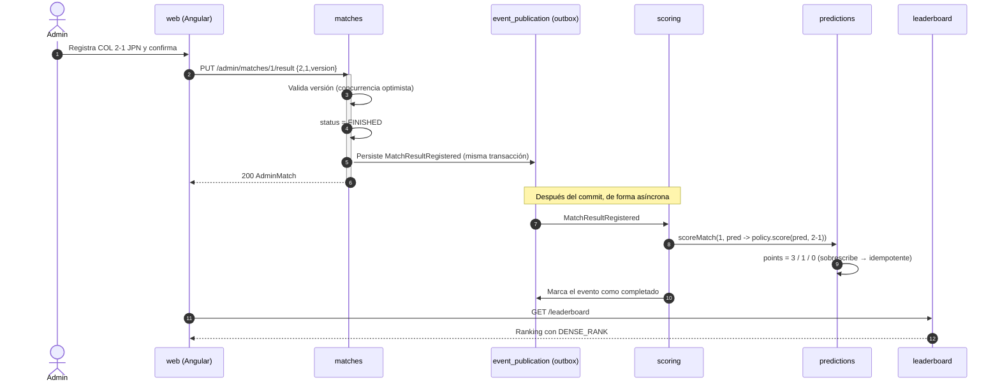

# Arquitectura

Diagramas en notación **C4** (contexto → contenedores → componentes) y flujo de datos del caso de uso principal.
Los diagramas de componentes de cada módulo también se **generan automáticamente** desde el código con Spring Modulith
(`./mvnw test` → `backend/target/spring-modulith-docs/`), así la documentación no se desactualiza.

## Nivel 1 · Contexto

## Nivel 2 · Contenedores

| Contenedor | Por qué esta tecnología |
|---|---|
| **web** | Angular 21 (zoneless, signals) compilado a estáticos. nginx pone la SPA y la API en el mismo origen: la cookie de refresh es *first-party* y no hay CORS en producción. |
| **api** | Spring Boot 4: Spring Security (JWT nativo con Nimbus), validación, Actuator. Spring Modulith hace verificables los límites entre módulos y persiste los eventos. |
| **db** | Relacional (requisito). `timestamptz` para horarios, `DENSE_RANK()` para el ranking, restricciones `CHECK`/`UNIQUE` como última línea de defensa. |

## Nivel 3 · Componentes del API (módulos)

Reglas (verificadas por `ModularityTests`):

- Cada módulo expone solo su paquete raíz (API). `internal` y `web` son privados.
- **Sin ciclos:** `matches` necesita el conteo de predicciones, pero en vez de depender de `predictions` define un puerto
  (`PredictionStatistics`) que `predictions` implementa (inversión de dependencias).
- `matches` **no conoce** a `scoring`: se comunican por un evento.

## Flujo de datos · Registrar un resultado

Si el paso 8 falla (p. ej. la BD se cae), el evento queda **incompleto** en `event_publication` y se reprocesa al
reiniciar. Como el recálculo sobrescribe los puntos, reprocesarlo es seguro.

## ¿Por qué escala?

| Dimensión | Hoy | Siguiente paso (sin reescribir) |
|---|---|---|
| **Tráfico de la API** | Backend *stateless* (JWT + refresh en BD) | N réplicas detrás de un balanceador (Azure Container Apps / Kubernetes) |
| **Lecturas del ranking** | 1 consulta agregada con índices | Proyección `leaderboard_snapshot` actualizada por el mismo evento + caché |
| **Recálculo de puntos** | Listener asíncrono en proceso con outbox | Externalizar el evento a Kafka / Azure Service Bus (soporte nativo de Spring Modulith) |
| **Extraer un servicio** | Módulos con límites verificados y comunicación por eventos | `scoring` o `leaderboard` a su propio despliegue |
| **Rate limiting** | En memoria (1 instancia) | Redis / Bucket4j distribuido, mismo contrato |
| **Frontend** | Estáticos | CDN |
| **Base de datos** | PostgreSQL gestionado | Réplicas de lectura para `leaderboard` |

**Por qué no microservicios desde el día 1:** para un grupo privado agregarían red, despliegues múltiples y
consistencia distribuida sin beneficio real. El monolito modular deja la puerta abierta con costo casi cero
([ADR-0002](../specs/adr/0002-monolito-modular.md)).
