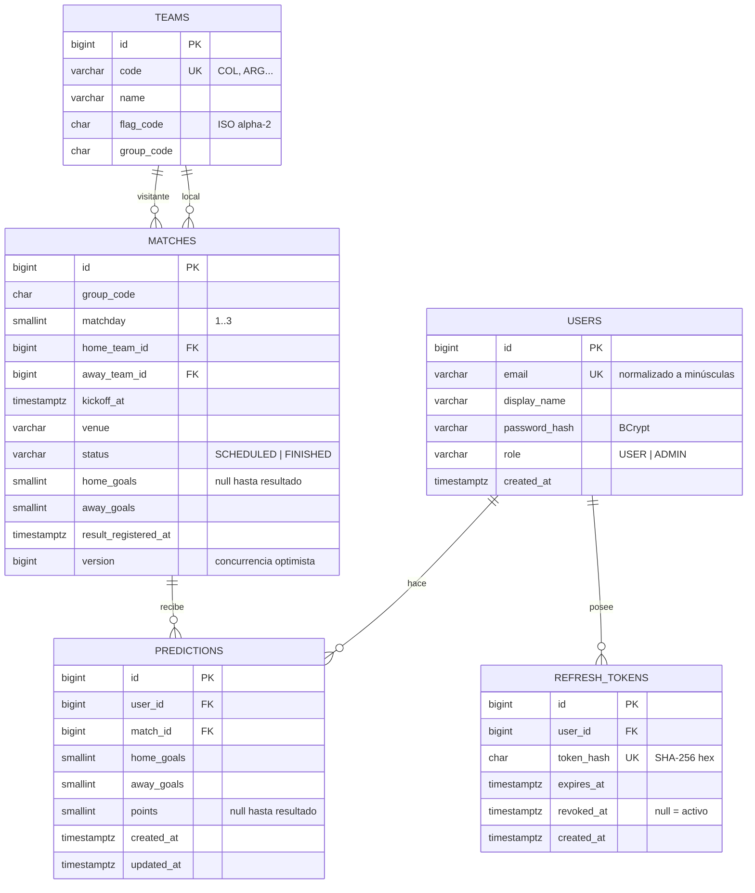

# Esquema de base de datos

PostgreSQL 17. El esquema se versiona con **Flyway** en
`backend/src/main/resources/db/migration`. Este documento es la vista de diseño; las migraciones son la verdad ejecutable.

## Restricciones e índices

| Tabla | Restricción / índice | Motivo |
|---|---|---|
| `users` | `UNIQUE (email)` (se guarda en minúsculas) | Email único sin importar mayúsculas |
| `users` | `CHECK (role IN ('USER','ADMIN'))` | Integridad del rol |
| `refresh_tokens` | `UNIQUE (token_hash)`, índice en `user_id` | Búsqueda por hash y revocación masiva |
| `matches` | `CHECK (home_team_id <> away_team_id)` | Un equipo no juega contra sí mismo |
| `matches` | `CHECK` goles 0–20 y ambos null o ambos no null | Resultado coherente |
| `matches` | Índice en `kickoff_at` | Listado ordenado |
| `predictions` | `UNIQUE (user_id, match_id)` | RN-01 y protección ante requests concurrentes |
| `predictions` | Índice en `match_id` | Recálculo por partido |
| `predictions` | `CHECK` goles 0–20, `points` 0–3 o null | Integridad |

La tabla `event_publication` la crea Spring Modulith (registro de eventos, ver ADR-0003).
